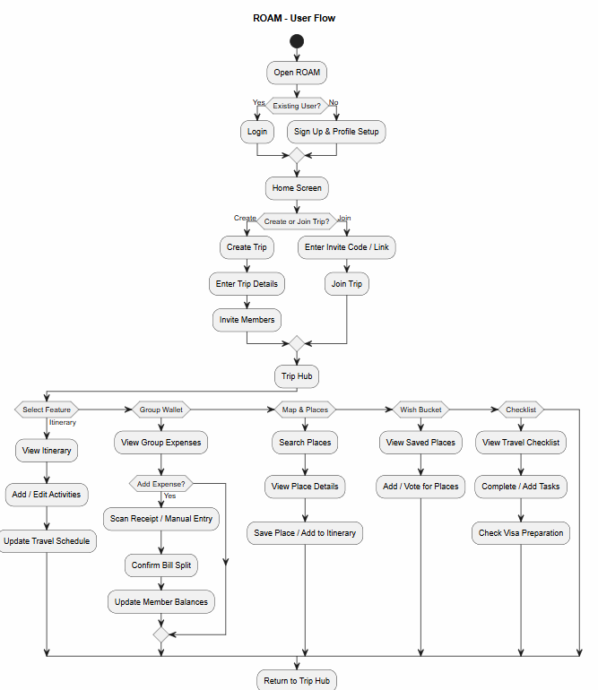
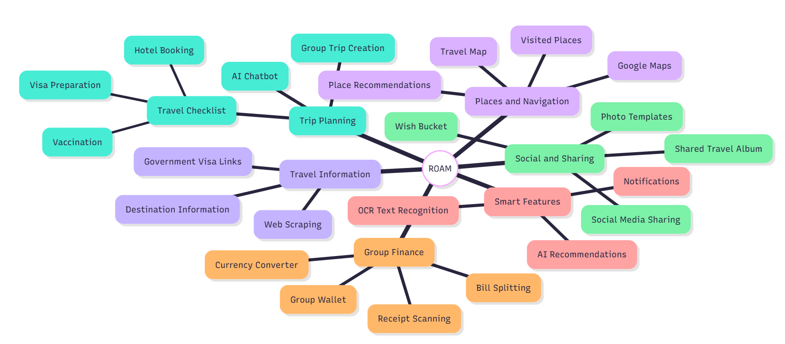

# ROAM

**ROAM** is an all-in-one group travel planning application developed by **Team Synthesize**. It is designed to make trip planning more organized by bringing itinerary planning, shared expenses, place discovery, travel preparation, and group collaboration into one platform.
Video Presentation: [Unlisted Youtube Link] 
Presentation Slides: https://canva.link/ayhpnj4ei2m82d2 

## Team Synthesize

- Chua Wen Xuan
- Maxwell Jared Daniel
- Sou Yong Herng
- Chu Lip Min

## Project Overview

Planning a trip often requires travellers to manage budgets, itineraries, destinations, expenses, schedules, and group preferences across multiple apps and group chats. This becomes more difficult for group travellers because members may have different budgets, schedules, and preferences, especially when plans change during the trip.

ROAM aims to reduce this fragmentation by allowing users to create or join trips, plan activities, manage shared expenses, search and save places, prepare travel checklists, and collaborate with their travel group from one application.

## Target Users

ROAM is mainly designed for:

- Travellers
- Friend groups
- Students
- Families
- Small groups planning trips together

## Core Features

### Group Trip Creation
Create a new trip, enter trip details, invite members, or join an existing trip using an invitation code or link.

### Group Wallet
Manage and track shared trip expenses in one place so members can understand the group's spending and balances.

### Receipt & Bill Splitting
Scan receipts or enter expenses manually, then split the bill between trip members and update their balances.

### Real-Time Currency Conversion
Help travellers quickly check currency exchange values while managing overseas expenses.

### Itinerary Planning
View, add, and edit activities while keeping the group's travel schedule organized.

### Maps & Places
Search for destinations, view place details, save locations, and add selected places to the itinerary.

### Wish Bucket
Save interesting places and allow group members to add or vote for places they want to visit.

### Travel Checklist
Track important preparation tasks such as visa preparation, vaccination, hotel arrangements, and other pre-travel requirements.

### Visa Preparation
Provide easier access to official visa information and preparation resources.

### Travel Map & Visited Places
Allow users to view and keep track of locations they have visited during a trip.

### Shared Travel Album
Allow group members to upload travel photos and keep shared memories from the journey.

### Social Media Place Sharing
Make it easier to share interesting travel locations and travel content with others.

### Web Scraping
Collect useful travel information from different web sources where appropriate.

### AI Chatbot
Provide quick travel assistance and answer common travel-related questions.

## What Makes ROAM Different

ROAM combines several functions that are commonly separated across different travel and finance applications.

Key differentiators include:

- **Social Media Place Sharing + Shared Album** — users can document their journey, keep a shared memory log, and prepare content for social sharing.
- **Split-Group Itineraries** — groups can temporarily separate to explore different places and later rejoin at a planned meeting point.
- **Group Wallet + Receipt/Bill Splitting** — shared expenses, bill splitting, budget visibility, and member balances are handled within the same trip workspace.

## Ideation & Process

The mindmap below shows the main ideas brainstormed for ROAM, grouped into areas such as trip planning, group finance, navigation, social sharing, travel information, and smart features.



## User Flow

The user flow below shows how users navigate through ROAM, from login or sign-up to creating or joining a trip and accessing the main features through the Trip Hub.



A typical ROAM user journey is:

1. Open ROAM.
2. Log in or sign up and complete profile setup.
3. Create a new trip or join an existing trip.
4. Enter the **Trip Hub**.
5. Access features such as:
   - Itinerary
   - Group Wallet
   - Maps & Places
   - Wish Bucket
   - Travel Checklist
6. Complete actions inside each feature and return to the Trip Hub.

## Tech Stack

| Area | Technology |
|---|---|
| Frontend | Flutter |
| Backend | Supabase |
| Database | PostgreSQL via Supabase |
| Authentication | Supabase Authentication |
| Storage | Supabase Storage |
| Places Search | Google Places API |
| Maps | Google Maps SDK |
| Receipt OCR | Google ML Kit Text Recognition |
| Web Scraping | Scrape.do |
| Notifications | Firebase Cloud Messaging (FCM) |
| Web Hosting | Firebase Hosting |
| Backend Hosting | Supabase Cloud |

## Technical Architecture

ROAM uses Flutter as the client application for web and mobile. Flutter communicates with Supabase for authentication, database operations, storage, and backend services. External APIs and services provide mapping, place search, OCR, web scraping, and notifications.

```text
User
  |
  v
Flutter App
  |
  +---------------------> Google Maps SDK / Google Places API
  |
  +---------------------> Google ML Kit Text Recognition
  |
  +---------------------> Scrape.do
  |
  +---------------------> Firebase Cloud Messaging
  |
  v
Supabase
  |
  +--> Authentication
  +--> PostgreSQL Database
  +--> Storage
  +--> Backend Services
```

## Build Scope

The prototype prioritizes the following core functions:

- Group Trip Creation
- Group Wallet
- Receipt & Bill Splitting
- Real-Time Currency Conversion
- Travel Checklist
- Google Maps & Places integration
- Basic notifications

Secondary features, depending on development time, include:

- Advanced AI assistance
- Social media sharing
- Travel photo templates
- Shared albums
- More complex web scraping

## Project Feasibility & Constraints

Expected constraints include:

- Free-tier limits
- API request quotas
- Web-scraping restrictions
- Secure API-key management
- User-data security
- Development time available for secondary features

## Mentor Feedback Incorporated

Based on mentor consultation, the project direction was refined to:

- Reduce unnecessary AI usage and use algorithmic approaches where more practical.
- Explore image-based location identification approaches such as Google Lens.
- Avoid relying only on user-uploaded links as input.
- Use web scraping for selected information-gathering tasks.
- Add a shared photo album for travel memories and photo-template features.

## Prototype

The UI prototype is developed using Flutter and will be uploaded to GitHub together with the project source code.

**Presentation Slides:** https://canva.link/ayhpnj4ei2m82d2

**Video Presentation:** Add the unlisted YouTube link here.

**GitHub Repository:** Add the repository link here.

## Getting Started

> The following are standard Flutter setup steps. Adjust them if the final repository uses additional environment variables, build scripts, or platform-specific configuration.

### Prerequisites

Install:

- Flutter SDK
- Dart SDK
- Android Studio and/or VS Code
- Chrome for Flutter Web testing
- Git

Check your Flutter installation:

```bash
flutter doctor
```

### Clone the Repository

```bash
git clone <your-repository-url>
cd <project-folder>
```

### Install Dependencies

```bash
flutter pub get
```

### Configure Environment / API Keys

The project may require credentials for:

- Supabase
- Google Places API
- Google Maps SDK
- Firebase Cloud Messaging
- Scrape.do

Do not commit private API keys or service credentials directly to GitHub. Store them using the environment/configuration method used by the final project.

### Run on Web

```bash
flutter run -d chrome
```

### Run on Android

Connect an Android device or start an emulator, then run:

```bash
flutter run
```

### Build Flutter Web

```bash
flutter build web
```

The generated web build can then be deployed to Firebase Hosting.

## Roadmap

### Year 1 — Market Penetration

- Launch a simplified version of itinerary and budgeting tools.
- Focus on the core group-planning and cost-splitting experience.
- Use manual or basic backend processes where automation is not yet necessary.
- Target student groups, clubs, societies, and friend groups planning local trips.

### Year 2 — B2B Network & Ecosystem Automation

- Automate selected processes introduced in Year 1.
- Add dynamic pricing APIs and more intelligent itinerary suggestions.
- Explore partnerships with hotels, attractions, and local travel businesses.
- Introduce business-intelligence dashboards for partners.

### Year 3 — Gamification & Regional Scale

- Introduce points and rewards.
- Allow users to earn rewards through selected travel partners.
- Enable targeted partner campaigns inside the itinerary experience.
- Expand beyond Kuala Lumpur and Selangor into wider Southeast Asian travel corridors.

## Expected Impact

ROAM aims to:

- Reduce the need to switch between multiple travel-planning apps.
- Make group planning and expense management more seamless.
- Allow groups to split and rejoin their schedules more easily.
- Combine practical planning tools with social and memory-sharing features.
- Make travel planning more attractive and accessible for tech-savvy younger travellers.

## Current Status

ROAM is currently in the **prototype / development stage**. The team is prioritizing a functional integrated prototype before implementing every proposed secondary feature.

---

Developed by **Team Synthesize**.
